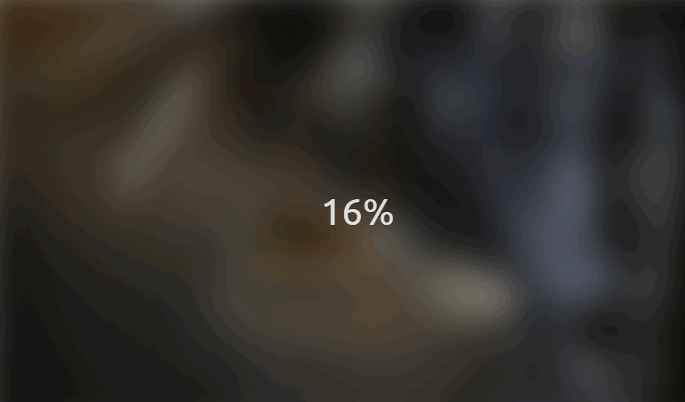

# Blurry Loading effect

## 🦉 Main information

Blurry loading image.

The project goal:
- start at 0% with a blurry image and when it gets to 100% the image should come into focus
- map different number ranges to the 0 to 100 load
- the image blur must be 30px when it starts and it's must to go down to zero 
- use a Stackoverflow function to map one number range to another

## ⚡ Built With

[HTML5](https://www.w3schools.com/html/) / [CSS3](https://www.w3schools.com/css/) / [JavaScript](https://www.w3schools.com/js/)